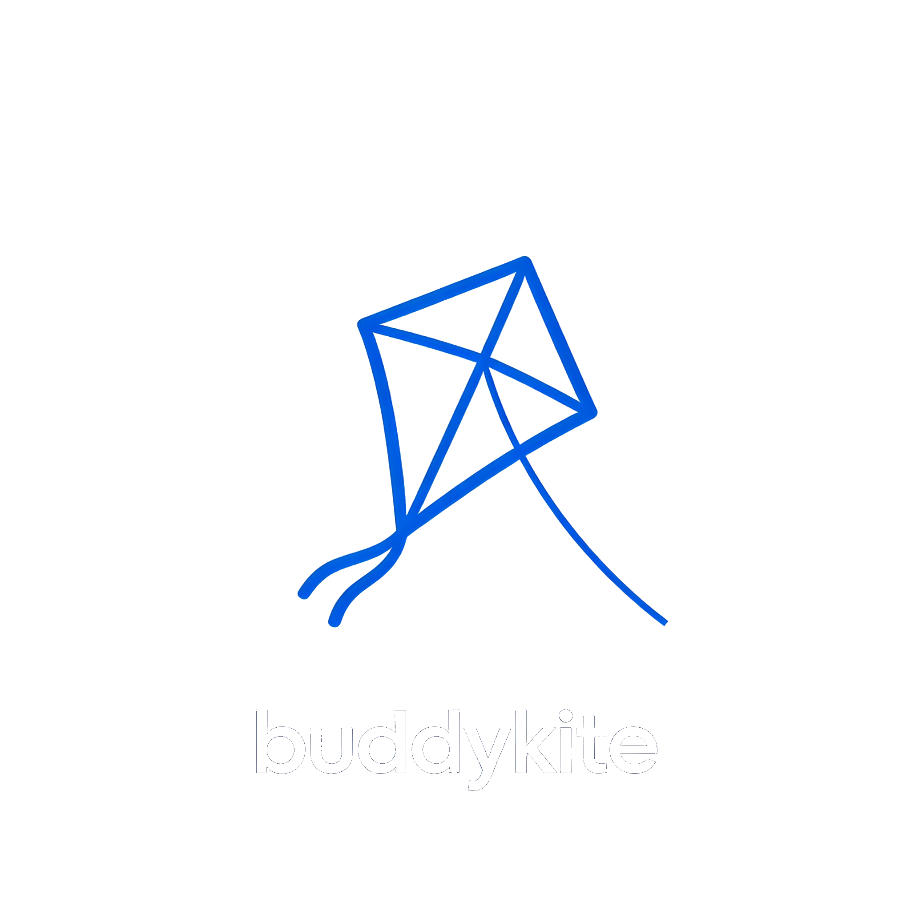
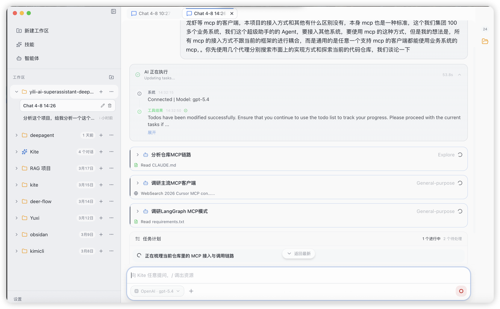

<div align="center">



# Kite

### Claude Code for Everyone

The simplest way to use the world's most powerful AI coding assistant — no terminal, no setup, just open and create.

[](https://github.com/blackholel/buddykite/stargazers)
[](LICENSE)
[](#installation)

[Download](#installation) · [Screenshots](#screenshots) · [Quick Start](#quick-start) · [Use Cases](#what-can-you-do-with-kite)

**[中文](./docs/README.zh-CN.md)** | **[Español](./docs/README.es.md)** | **[Deutsch](./docs/README.de.md)** | **[Français](./docs/README.fr.md)** | **[日本語](./docs/README.ja.md)**

</div>

---

## What is Kite?

**Kite puts Claude Code into a desktop app that anyone can use.**

Claude Code is arguably the most capable AI coding assistant available today — but it lives in the terminal. That means most people (designers, entrepreneurs, students, creators) can't access it at all.

Kite changes that. One download, one click, and you're talking to Claude Code through a clean visual interface. No command line. No Node.js. No configuration files. Just describe what you want, and watch it happen.

---

## Screenshots

<div align="center">


*Natural conversation interface — describe what you need, AI handles the rest*


*Real-time preview — see generated code, websites, and files instantly*



*Simple configuration — paste your API key and start creating*


*Real results — from idea to working prototype in minutes*

</div>

---

## Why Kite?

Every time I recommend AI tools to friends, I hear the same thing:

> "Sounds amazing, but... I don't know how to use the terminal."

Claude Code is incredible. But it requires:
- Command line knowledge
- Node.js installation
- Terminal comfort
- Developer mindset

**That locks out 99% of people.**

Kite removes every barrier. If you can type a sentence, you can use Kite.

---

## What Can You Do with Kite?

### 🚀 Build Things
"Create a landing page for my startup with email signup"
— Working website in minutes, no coding needed.

### 📊 Analyze Data
"Open this spreadsheet and show me which products are trending"
— Upload files, get visual insights instantly.

### 🎨 Design & Prototype
"Design a mobile app mockup for a food delivery service"
— From idea to interactive prototype, fast.

### 📝 Process Content
"Translate this document to 5 languages and format as PDF"
— Batch processing that used to take hours.

### 🔄 Automate Workflows
"Every time I drop an image here, compress it and convert to WebP"
— Create reusable Skills for repetitive tasks.

---

## Installation

| Platform | Download | Requirements |
|----------|----------|--------------|
| **macOS** (Apple Silicon) | [Download .dmg](https://github.com/blackholel/buddykite/releases/latest) | macOS 11+ |
| **Windows** | [Download .exe](https://github.com/blackholel/buddykite/releases/latest) | Windows 10+ |
| **Linux** | [Download .AppImage](https://github.com/blackholel/buddykite/releases/latest) | Ubuntu 20.04+ |

**That's it.** Download → Double-click → Start using.

---

## Quick Start

### 1. Open Kite
Double-click the app. That's the hardest step.

### 2. Add your API Key
Go to Settings, paste your [Anthropic API key](https://console.anthropic.com/). Supports Claude, OpenAI, DeepSeek, and any OpenAI-compatible service.

> 💡 New Anthropic accounts usually get free credits to start.

### 3. Start Creating
Type what you want:

```
"Help me build a personal portfolio website with dark mode"
```

Watch AI write code, create files, and show you a live preview — all in real time.

---

## Core Features

### 💬 Conversational AI
Talk to Claude Code like you'd talk to a colleague. Describe what you need in plain language, iterate by giving feedback, upload images and files for context.

### 📁 Workspaces
Organize different projects into separate spaces. Each has its own conversation history, files, and context. Switch between them freely.

### 🎨 Live Preview
See everything AI creates in real time — code with syntax highlighting, web page previews, generated images. Click any file to inspect or edit.

### 🔧 Skills & Agents
Create reusable Skills for tasks you do often. Configure specialized Agents (frontend expert, data analyst, writing assistant). Extend capabilities with MCP servers.

### 📱 Remote Access
Enable remote mode and access Kite from your phone or tablet browser. Same full experience, anywhere.

### 🌍 Multi-language
Interface and AI conversation in Chinese, English, Spanish, German, French, Japanese, and more.

---

## Who is Kite For?

| You are... | Kite helps you... |
|------------|-------------------|
| **Entrepreneur** | Build MVPs and prototypes without hiring developers |
| **Designer** | Create interactive prototypes and generate production code |
| **Student** | Learn coding with an AI tutor that explains every step |
| **Creator** | Automate content processing, batch operations, file management |
| **Anyone with ideas** | Turn thoughts into working software, websites, and tools |

---

## FAQ

**Do I need to know programming?**
No. That's the whole point. Describe what you want in everyday language.

**Is it free?**
Kite is free and open source. You pay only for AI API usage (usually a few cents per conversation).

**Is my data safe?**
Everything stays on your computer. Only conversation text goes to the AI service. No telemetry, no cloud storage.

**What AI services work?**
Anthropic Claude (recommended), OpenAI, DeepSeek, and any OpenAI API-compatible provider.

---

## Technical Details

<details>
<summary>For developers — click to expand</summary>

### Stack
- **Framework**: Electron + React 18 + TypeScript
- **State**: Zustand
- **Styling**: Tailwind CSS
- **AI Core**: @anthropic-ai/claude-code SDK
- **Rendering**: react-markdown + highlight.js

### Capabilities
- Full Agent Loop (tool execution, file ops, shell commands)
- MCP (Model Context Protocol) server support
- Multi-modal input (text, images, files)
- Streaming responses
- Tool permission management

### Development
```bash
git clone https://github.com/blackholel/buddykite.git
cd buddykite
npm install
npm run dev
```

</details>

---

## Community

- [Discussions](https://github.com/blackholel/buddykite/discussions) — Questions & ideas
- [Issues](https://github.com/blackholel/buddykite/issues) — Bug reports & feature requests
- [Contributing](CONTRIBUTING.md) — Help build Kite

---

## License

Personal use is free. Commercial use requires a license — contact: 505855752@qq.com

See [LICENSE](LICENSE) for details.

---

<div align="center">

**AI should not require a CS degree.**

If Kite helped you build something cool, [tell us about it](https://github.com/blackholel/buddykite/discussions).

Star ⭐ this project to help others find it.

</div>
