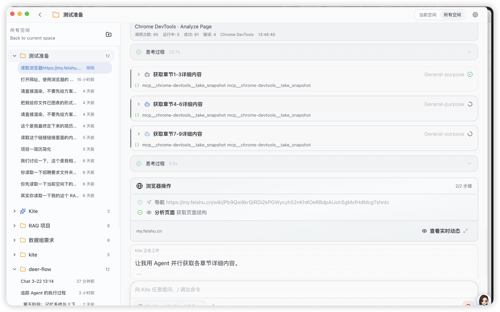

<div align="center">


# Kite

### Claude Code, but for Everyone

A desktop app that puts the world's most powerful AI coding assistant into a visual interface anyone can use — no terminal, no setup, just open and create.

[](https://github.com/blackholel/buddykite/stargazers)
[](LICENSE)
[](#installation)

[Download](#installation) · [Features](#features) · [FAQ](#faq)

**[中文](./docs/README.zh-CN.md)** | **[Español](./docs/README.es.md)** | **[Deutsch](./docs/README.de.md)** | **[Français](./docs/README.fr.md)** | **[日本語](./docs/README.ja.md)**

</div>

---

## What is Kite?

[Claude Code](https://docs.anthropic.com/en/docs/claude-code) is the most capable AI coding assistant — but it lives in the terminal, which locks out most people.

Kite wraps it into a desktop app. Download, open, start talking. No command line, no Node.js, no dev environment. Describe what you want in plain language, and watch AI build it for you.

**For entrepreneurs, designers, students, and anyone who has ideas but doesn't code.**

---

## Features

<div align="center">


**Data Visualization** — Ask AI to analyze data and generate interactive charts, reports, and visual insights from your files.

<br>


**Auto-load Skills** — AI automatically identifies what capabilities are needed and loads the right skills to get the job done.

<br>



**Sub-agents** — Automatically spawns specialized sub-agents to handle complex tasks in parallel, like a team working for you.

<br>


**Built-in Skills Marketplace** — Browse and activate from a rich library of pre-built skills — content creation, data processing, code generation, and more.

<br>


**From Idea to Result** — Describe what you need, AI handles everything — writing code, creating files, generating previews — all visible in real time.

</div>

---

## Installation

| Platform | Download | Requirements |
|----------|----------|--------------|
| **macOS** (Apple Silicon) | [Download .dmg](https://github.com/blackholel/buddykite/releases/latest) | macOS 11+ |
| **Windows** | [Download .exe](https://github.com/blackholel/buddykite/releases/latest) | Windows 10+ |
| **Linux** | [Download .AppImage](https://github.com/blackholel/buddykite/releases/latest) | Ubuntu 20.04+ |

Download → Double-click → Paste your API key → Start creating.

Supports [Anthropic Claude](https://console.anthropic.com/) (recommended), OpenAI, DeepSeek, and any OpenAI-compatible service.

---

## FAQ

**Do I need programming knowledge?**
No. Describe what you want in everyday language. That's it.

**Is it free?**
Kite is free and open source. You only pay for AI API usage (a few cents per conversation, new accounts usually get free credits).

**Is my data safe?**
Everything stays on your machine. Only conversation text is sent to the AI provider. No telemetry, no cloud storage.

---

## Technical Details

<details>
<summary>For developers</summary>

### Stack
- Electron + React 18 + TypeScript
- Zustand / Tailwind CSS
- @anthropic-ai/claude-code SDK
- MCP (Model Context Protocol) support
- Full Agent Loop with tool execution

### Development
```bash
git clone https://github.com/blackholel/buddykite.git
cd buddykite
npm install
npm run dev
```

</details>

---

## Community & Support

- [Discussions](https://github.com/blackholel/buddykite/discussions) — Questions & ideas
- [Issues](https://github.com/blackholel/buddykite/issues) — Bug reports & feature requests

---

## License

Personal use is free. Commercial use requires a license — contact: 505855752@qq.com. See [LICENSE](LICENSE).

---

<div align="center">

**Star ⭐ to help others discover Kite.**

</div>
